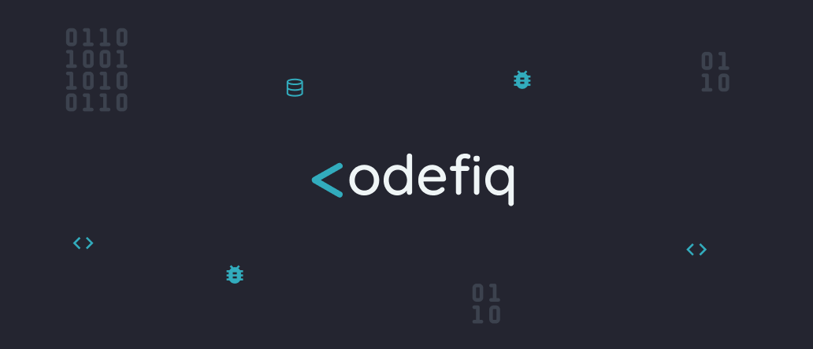

<h1 align="center">
  
</h1>

🌐 REST API do Codefiq

 <a href="#-objetivo">Objetivo</a> •
 <a href="#-executando-o-codefiq">Como executar</a> • 
 <a href="#-tecnologias">Tecnologias</a> •  
 <a href="#-desenvolvedores">Desenvolvedores</a> • 
 <a href="#-licença">Licença</a>

---

## 💡 Objetivo

Neste repositório encontra-se todo o Backend do projeto [Codefiq](https://github.com/heyloh/codefiq/).

---

## 💻 Executando o Codefiq

Acesse o repositório do App para mais informações: [Codefiq](https://github.com/heyloh/codefiq/)

---

## 🛠 Tecnologias

- <a href="https://nodejs.org/en/">NodeJS</a>
- <a href="https://expressjs.com/">Express</a>
- <a href="https://nodemon.io/">Nodemon</a>
- <a href="https://www.docker.com/">Docker</a> 🐋
- <a href="https://sequelize.org/">Sequelize</a>
- <a href="https://www.postgresql.org/">PostgreSQL</a> 🐘
- <a href="https://jestjs.io/">Jest</a>
- <a href="">JWT</a>

> Mais informações no arquivo `package.json`

---

## 👨‍💻 Desenvolvedores

### Arlene Pelenda([@Julenne](https://github.com/Julenne))

### Lohana Torres([@heyloh](https://github.com/heyloh))

### Gean de Magalhães([@GE28](https://github.com/GE28))

### Mariana da Conceição([@MariTdc](https://github.com/MariTdc))

---

## 📝 Licença

Este projeto esta sobe a licença [Apache 2.0](./LICENSE).

---

Feito com 💙 por Lohana Torres 👋🏽

